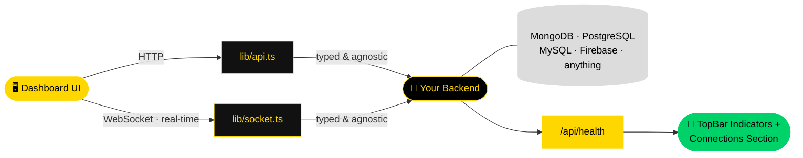

<div align="center">


[](https://git.io/typing-svg)

<br/>

<p align="center">
  
  
  
</p>

<p align="center">
  
  
  
  
  
  
</p>

<br/>

**Dashboard Control:** A real-time, "launch control"-style admin dashboard template, built to be cloned and adapted to **any business and any backend/database**.

🎛️ Nothing on the frontend is locked to a specific stack, provider, or color palette. All brand customization lives in **2 files**, and the data layer talks HTTP/WebSocket to your API — it never touches a database directly — so you can use MongoDB, PostgreSQL, MySQL, Firebase, or whatever you need, without touching the frontend.

*Modular · Backend-Agnostic · Production-Ready*

</div>

---

## 🎨 Customization — Just 2 Files

<div align="center">

| File | Controls |
|:-----|:---------|
| `app/globals.css` (`:root` block) | The entire color palette (accent, backgrounds, text, states) via CSS variables — no component has a hardcoded color |
| `config/business.ts` | Business name, tagline, logo initials, menu labels, and the sample content used by the live-data simulation |

</div>

Full guide in [`config/README.md`](./config/README.md), including how to adjust the data model (`lib/types.ts`) if your business doesn't fit "bookings / sales / messages / users."

---

## 📋 Template Status

<div align="center">

| Module | Status |
|:-------|:-------|
| 🚀 **Entry flow** | Splash screen → Login → Dashboard, on a single route |
| 🔑 **Login** | Demo mode (grants access without validating credentials) · a real-auth block is already written and commented out in `lib/auth-context.tsx` |
| 📊 **Dashboard** | Simulated data (`lib/mockData.ts`) that self-refreshes to feel real-time |
| 🔌 **Connection layer** | `lib/api.ts` and `lib/socket.ts` — typed and provider-agnostic (HTTP/WebSocket) |

</div>

---

## 🧭 Included Sections

<div align="center">

| Section | Description |
|:--------|:-------------|
| 📈 **Overview** | KPIs and a general business summary |
| 📅 **Bookings** | Appointment/reservation management |
| 💰 **Sales** | Sales tracking |
| 💬 **Messaging** | Multi-channel messaging |
| 👤 **Users** | Full customer record: info, bookings, purchases, messages |
| 🔗 **Connections** | Status of your data sources + environment variables |

</div>

---

## 🏗️ Connection Architecture


---

## 🐳 Run Locally (No Docker)

```bash
npm install
cp .env.example .env.local
npm run dev
```

Open `http://localhost:3000`.

### Development (with hot-reload)

```bash
cp .env.example .env.local
docker compose -f docker-compose.dev.yml up --build
```

Your code is mounted as a volume, so changes are reflected instantly inside the container. Open `http://localhost:3000`.

### Production

```bash
cp .env.example .env.local
docker compose up --build -d
```

Builds a minimal image using Next.js **standalone output** (`next.config.mjs` already sets `output: "standalone"`): no bloated `node_modules`, no full source tree, running as a non-root user.

> ⚠️ If your `NEXT_PUBLIC_API_URL` / `NEXT_PUBLIC_SOCKET_URL` change, you must rebuild the image (`docker compose up --build`) — these are public Next.js variables, baked into the client bundle at **build time**, not runtime.

### Manual Build (No Compose)

```bash
docker build -t dashboard-control \
  --build-arg NEXT_PUBLIC_API_URL=https://your-backend.com \
  .
docker run -p 3000:3000 dashboard-control
```

### Deploy Your Own Backend in the Same Compose

`docker-compose.yml` includes commented-out examples of a `backend` service and a database service (`mongo`) so you can spin everything up together for a self-contained deployment. Uncomment them and adjust the image/port to match your real backend.

---

## 🔌 Connecting a Real Backend

<div align="center">

| Step | Action |
|:----:|:-------|
| 1 | Define `NEXT_PUBLIC_API_URL` (and `NEXT_PUBLIC_SOCKET_URL` if using WebSockets) in `.env.local` or as a Docker `--build-arg` |
| 2 | In `lib/auth-context.tsx`, replace the body of `login()` with the already-written "REAL MODE" section (calls `api.login`) |
| 3 | In `components/dashboard/DashboardShell.tsx`, replace the `seed*()` calls from `lib/mockData.ts` with calls to `lib/api.ts` (`getBookings`, `getMessages`, `getSales`, `getCustomers`) |
| 4 | Expose an `/api/health` endpoint returning `{ "primaryDB": "CONNECTED", ... }` — `api.clusterStatus()` already consumes it and feeds the TopBar indicators and the Connections section |

</div>

---

## 📂 Structure

```text
app/                     — App Router (splash + login + shell, single route)
components/dashboard/    — Sidebar, TopBar, panels/ (one per section), ui/
config/                  — business.ts (brand + labels), README.md (guide)
lib/                     — types.ts, mockData.ts, api.ts, socket.ts, auth-context.tsx
hooks/                   — useLiveClock
Dockerfile               — production build (standalone)
Dockerfile.dev           — development build (hot-reload)
docker-compose.yml       — production stack
docker-compose.dev.yml   — development stack
```

---

## 🎨 Design Tokens

```css
/* app/globals.css — :root block */
:root {
  --accent: #FFD700;        /* 🟡 Primary accent */
  --background: #DCDCDC;    /* 🩶 Base background */
  --surface: #111111;       /* ⚫ Dark surfaces */
  --text: #000000;          /* ⚫ Typography */
}
```

<div align="center">

| Token | Hex | Role |
|:------|:----|:-----|
| `--accent` | `#FFD700` | CTAs · brand highlights |
| `--background` | `#DCDCDC` | Base background · borders |
| `--surface` | `#111111` | Panels and cards in dark mode |
| `--text` | `#000000` | Primary typography |

</div>

---

<div align="center">

```
╔══════════════════════════════════════════════════════════════════╗
║                                                                    ║
║   "Clone it, swap the palette and the labels,                     ║
║    and you have a dashboard ready for any business."              ║
║                                                                    ║
╚══════════════════════════════════════════════════════════════════╝
```

*Dashboard Control — base template of the* **Software DT** *ecosystem*


</div>


<div align="center">


[](https://git.io/typing-svg)

<br/>

<p align="center">
  
  
  
</p>

<p align="center">
  
  
  
  
  
  
</p>

<br/>

**Dashboard Control:** A real-time, "launch control"-style admin dashboard template, built to be cloned and adapted to **any business and any backend/database**.

🎛️ Nothing on the frontend is locked to a specific stack, provider, or color palette. All brand customization lives in **2 files**, and the data layer talks HTTP/WebSocket to your API — it never touches a database directly — so you can use MongoDB, PostgreSQL, MySQL, Firebase, or whatever you need, without touching the frontend.

*Modular · Backend-Agnostic · Production-Ready*

</div>

---

## 🎨 Customization — Just 2 Files

<div align="center">

| File | Controls |
|:-----|:---------|
| `app/globals.css` (`:root` block) | The entire color palette (accent, backgrounds, text, states) via CSS variables — no component has a hardcoded color |
| `config/business.ts` | Business name, tagline, logo initials, menu labels, and the sample content used by the live-data simulation |

</div>

Full guide in [`config/README.md`](./config/README.md), including how to adjust the data model (`lib/types.ts`) if your business doesn't fit "bookings / sales / messages / users."

---

## 📋 Template Status

<div align="center">

| Module | Status |
|:-------|:-------|
| 🚀 **Entry flow** | Splash screen → Login → Dashboard, on a single route |
| 🔑 **Login** | Demo mode (grants access without validating credentials) · a real-auth block is already written and commented out in `lib/auth-context.tsx` |
| 📊 **Dashboard** | Simulated data (`lib/mockData.ts`) that self-refreshes to feel real-time |
| 🔌 **Connection layer** | `lib/api.ts` and `lib/socket.ts` — typed and provider-agnostic (HTTP/WebSocket) |

</div>

---

## 🧭 Included Sections

<div align="center">

| Section | Description |
|:--------|:-------------|
| 📈 **Overview** | KPIs and a general business summary |
| 📅 **Bookings** | Appointment/reservation management |
| 💰 **Sales** | Sales tracking |
| 💬 **Messaging** | Multi-channel messaging |
| 👤 **Users** | Full customer record: info, bookings, purchases, messages |
| 🔗 **Connections** | Status of your data sources + environment variables |

</div>

---

## 🏗️ Connection Architecture



---

## 🐳 Run Locally (No Docker)

```bash
npm install
cp .env.example .env.local
npm run dev
```

Open `http://localhost:3000`.

### Development (with hot-reload)

```bash
cp .env.example .env.local
docker compose -f docker-compose.dev.yml up --build
```

Your code is mounted as a volume, so changes are reflected instantly inside the container. Open `http://localhost:3000`.

### Production

```bash
cp .env.example .env.local
docker compose up --build -d
```

Builds a minimal image using Next.js **standalone output** (`next.config.mjs` already sets `output: "standalone"`): no bloated `node_modules`, no full source tree, running as a non-root user.

> ⚠️ If your `NEXT_PUBLIC_API_URL` / `NEXT_PUBLIC_SOCKET_URL` change, you must rebuild the image (`docker compose up --build`) — these are public Next.js variables, baked into the client bundle at **build time**, not runtime.

### Manual Build (No Compose)

```bash
docker build -t dashboard-control \
  --build-arg NEXT_PUBLIC_API_URL=https://your-backend.com \
  .
docker run -p 3000:3000 dashboard-control
```

### Deploy Your Own Backend in the Same Compose

`docker-compose.yml` includes commented-out examples of a `backend` service and a database service (`mongo`) so you can spin everything up together for a self-contained deployment. Uncomment them and adjust the image/port to match your real backend.

---

## 🔌 Connecting a Real Backend

<div align="center">

| Step | Action |
|:----:|:-------|
| 1 | Define `NEXT_PUBLIC_API_URL` (and `NEXT_PUBLIC_SOCKET_URL` if using WebSockets) in `.env.local` or as a Docker `--build-arg` |
| 2 | In `lib/auth-context.tsx`, replace the body of `login()` with the already-written "REAL MODE" 